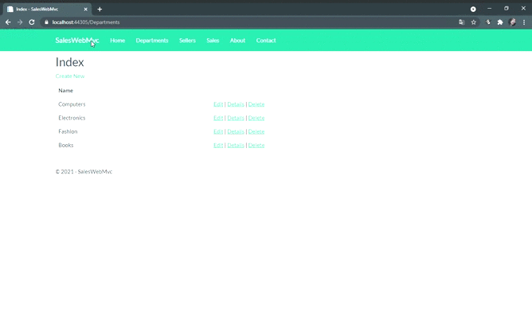
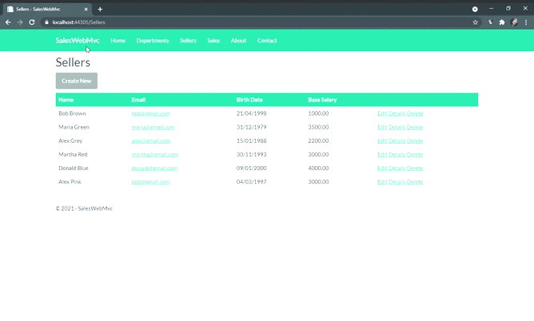
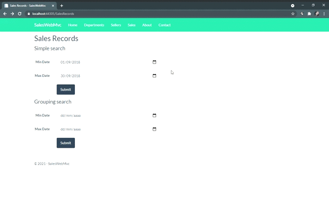

# Sales Web

## Sobre o projeto :question:
Aplicação web, denominada Sales Web, que atua como um relatório de vendas. 
Construído com o intuito de fixar os conceitos de C# e aprender mais sobre banco de dados, utlizando o padrão de projeto de software MVC (Model-View-Controller). 

## Funcionalidades :joystick:
### Seção de Departamentos 
É possível visualizar os departamentos cadastrados, os detalhes do mesmo, adicionar um novo ou deletar.

## Seção de Vendedores
É possível visualizar os vendedores cadastrados, os detalhes do mesmo, podendo adiconar e deletar.

_OBS: Vendedores com vendas realizadas não podem ser deletados!_

## Seção de Vendas
É possível visualizar as vendas efetuadas nas datas que o usuário informar.

_OBS: Se não for informado uma data, por padrão, é mostrado do primeiro até o último dia do ano atual._

Tendo uma busca simples:

E uma agrupada por departamento:

